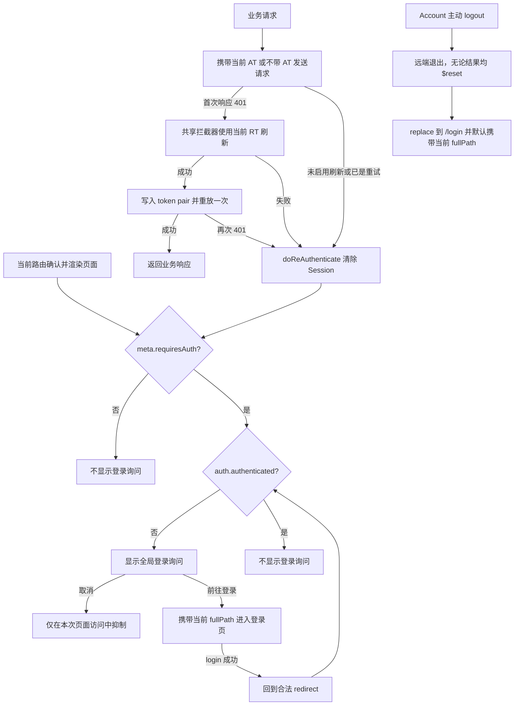

# Mobile 应用模块实施计划

## 1. 计划状态

| 项目 | 当前状态 |
| --- | --- |
| 基线提交 | `07ca6865108090ff6d53b6fca609fb6aced24190` |
| 工作分支 | `codex/feat-mobile-app`，当前基于上述提交 |
| 参考项目 | 已克隆到仓库外 `/Volumes/fc/novum/vant-demo`，当前参考提交 `c382aeba` |
| 当前阶段 | 实现、自动化验收与代码评审已完成；以当前分支本地提交交付 |
| 本地交付 | 使用 `pnpm run commit` 在当前分支创建本地提交 |
| 远端交付 | 不推送、不创建 PR |

Vant 一手资料与参考 demo 的核对结果见 [mobile-vant-research.md](./mobile-vant-research.md)。

## 2. 目标与非目标

### 目标

- 在 `apps/mobile` 新增独立的 Vue 3 + TypeScript + Vite 移动端应用。
- 使用 Vant 4，组件和组件样式都按需加载。
- 接入现有 pnpm/Turbo 仓库，但使用标准 Vue 生态独立搭建应用，不依赖服务 Admin 的 Vben 应用基础设施。
- 只在出现具体 Mobile 使用场景时研究 Vben 公共能力库；借鉴其优秀实现思路前，明确来源、Mobile 落点和取舍，不预先承诺复用。
- Customer 是 Mobile 与 Server 共享的规范身份术语，并且独立于 Admin User；不复用 Admin Session，也不默认继承 Admin 角色、权限或菜单。
- Customer 与 Admin 使用独立账号记录和 Session，但共享全局 RBAC 授权域；角色绑定是显式授权事实，不按身份类型限制角色或权限。
- 在 `apps/server` 新增 Customer 功能，本轮提供登录、刷新、退出和当前 Customer 信息查询能力，供 Mobile 使用。
- 新增 `nv_customer` 表；字段参考 `sys_admin`，但不包含 `description` 和 `home_path`。
- 新增内置 `customer` 角色并强制绑定到每个有效 Customer；初始化三条 Session 公开权限和一条绑定到该角色的当前 Customer 信息查询权限，不创建菜单绑定。
- 路由全部由前端静态声明，不设置认证路由守卫。页面进入后，全局登录询问组件直接判断当前路由的 `meta.requiresAuth` 和认证状态。
- `useAuthStore` 维护 AT、RT、派生认证状态、当前 Customer 信息和登录加载状态；主动退出负责跳转登录页，但刷新、重试、登录成功 redirect 和提示状态不进入 Store。
- 全局只挂载一个底部登录询问组件；页面不需要逐个引用它。
- 请求刷新与重新认证采用 Admin 现有行为，不增加 AT 一致性比较、RT 快照、请求集合或迟到响应隔离。

### 非目标

- 不复制 Admin 的菜单/RBAC、后端路由生成、管理页面、Element Plus 适配器或 Vben 布局。
- 不依赖 `@vben/locales`、`@vben/vite-config` 或 `@vben/tsconfig`；`@vben/request` 和 `@vben/utils` 只复用已有明确使用场景的通用能力。
- 不为了复用 Vben 公共能力而引入 Mobile 没有使用场景的配置、抽象或间接依赖。
- 不为 Customer/Admin 增加 RBAC 身份域字段、角色域字段或基于请求路径的 Token 过滤。
- 不改变 `apps/admin` 的请求行为；只调整 `src/api/request.ts` 以适配共享错误拦截器的新注入接口。
- 不实现 Customer 资料修改、密码修改、分页、创建、更新、删除、角色分配和公开注册。
- 不在本次骨架中设计 Mobile 的业务导航、业务页面或权限码体系。
- 不把客户端路由提示当作服务端授权；服务端仍负责保护接口。
- 不调用 `/sys/admin/login`、`/sys/admin/refresh` 或 `/sys/admin/logout` 作为 Mobile 会话接口。
- 不引入顶部 NProgress。当前静态路由没有路由数据加载，额外进度条没有足够收益；后续若出现明显等待，再按页面使用 Vant Loading/Overlay。

## 3. 与 Admin 和 Vben 的边界

不复制整个 `apps/admin`。只参考仓库接入约定和相邻代码风格，Mobile 的应用代码与构建配置从最小标准 Vue 应用开始。

| 参考来源 | Mobile 处理 | 原因 |
| --- | --- | --- |
| 根工作区配置 | 沿用 package 命名、catalog、Turbo scripts 和代码质量工具的接入方式 | Mobile 仍是 Novum monorepo 的应用 |
| `apps/admin` | 只参考相邻代码的命名、目录习惯和可验证的行为，不复制应用骨架 | Admin 的基础设施与业务边界不属于 Mobile |
| `@vben/request` | 复用 `RequestClient`、响应解包、并发刷新和单次重放；保留 `requestClient`、`baseRequestClient` 命名 | 该能力无 UI，并直接对应 Mobile 请求场景 |
| `@vben/utils` | 复用 `StorageManager`、`MemoryStorageDriver` 和 `trimToNull` | 已有明确的 locale 持久化、测试和登录输入场景 |
| `@vben/locales`、`@vben/vite-config` | 只在对应场景讨论时审阅实现，不作为 Mobile 依赖 | Mobile 直接使用 `vue-i18n` 和原生 Vite 配置 |
| Mobile 构建与 i18n | 分别使用原生 Vite 和 `vue-i18n` 在模块内实现最小能力 | 避免通过多项关闭配置来适配 Admin 基础设施 |

Mobile 通过 `@vben/utils/cache` 导入 `StorageManager` 和 `MemoryStorageDriver`，通过 `@vben/utils/shared` 导入 `trimToNull`；`@vben/request` 也只从 `@vben/utils/shared` 导入通用函数。两个子路径隔离了根入口聚合的路由 helper，根入口继续兼容现有调用方。

### 实现质量约束

- 只以当前 `07ca6865108090ff6d53b6fca609fb6aced24190` 基线和本计划为实现输入，不参考此前已丢弃的生成代码。
- 修改前遵循根目录及目标模块最近的 `AGENTS.md`、`CONTEXT.md` 和相关 ADR；不把实现约束写入术语表。
- 变量、函数、常量、类型和文件名必须语义准确、专业且尽可能简短；不使用破坏语义的缩写，也不为追求短名称丢失上下文。
- 优先沿用相邻代码的组织、命名、错误处理和测试风格；Customer 后端参考 Admin 的对应能力，Mobile 前端采用标准 Vue/Vant 风格，不复制 Admin 应用骨架。
- 只为已确认的使用场景增加抽象。脚手架保持最小、清晰、可复用，不引入与 Mobile 无关的配置、间接依赖、兼容层或占位能力。
- 保留已确认的 `requestClient`、`baseRequestClient`、`createRequestClient` 和 `useAuthStore` 命名；除必要的共享 Session/RBAC/request 改造外不做无关重构。

## 4. 依赖处置

版本进入根 `pnpm-workspace.yaml` catalog，`apps/mobile/package.json` 只使用 `catalog:` 或 `workspace:*`。

### 保留

| 依赖 | 类型 | 用途与约束 |
| --- | --- | --- |
| `dayjs` | dependency | 按要求保留；只在实际日期格式化处导入 |
| `pinia` | dependency | 承载精简的 Mobile Session 状态，并由持久化插件管理 AT/RT |
| `vue` | dependency | 应用运行时 |
| `vue-router` | dependency | 纯前端静态路由和当前路由元数据读取 |
| `@vben/request` | dependency | 复用 `RequestClient`、默认响应解包、并发 401 刷新和单次重放 |
| `axios` | dependency | 使用标准 HTTP client；认证、刷新和错误语义在 Mobile 内按具体场景设计 |
| `vue-i18n` | dependency | Mobile 本地 i18n 运行时；不加载 Vben 或 Admin 翻译 |
| `@vben/utils` | dependency | 使用 `StorageManager` 持久化 locale、`MemoryStorageDriver` 隔离 locale 测试，并用 `trimToNull` 规范化登录数据 |
| `@vueuse/core` | dependency | 用户确认保留；首期只使用 `useTitle` 同步当前页面标题，其他能力仍需出现具体场景后再导入 |
| `@vue/test-utils` | devDependency | 验证全局认证提示与 RouterView 协作 |

### 从 Admin 依赖集中删除

| 依赖 | 分类 | 删除原因 |
| --- | --- | --- |
| `element-plus`、`unplugin-element-plus` | UI | Mobile 统一使用 Vant |
| `@vben/common-ui`、`@vben/icons`、`@vben/layouts`、`@vben/styles` | UI | Admin 的组件、图标、布局和样式体系，不进入 Mobile |
| `@vben/access` | Admin 权限 | Mobile 不生成 RBAC 路由，也不做前端权限码过滤 |
| `@vben/plugins` | Admin 插件 | 表格、Motion 等插件无使用点 |
| `@vben/preferences` | Admin 配置 | Mobile 不继承 Admin 偏好设置和布局配置 |
| `@vben/hooks` | Admin/Vben hook | `useAppConfig` 改为直接读取类型化的 `import.meta.env`，其余 hook 无使用点 |
| `@vben/constants` | Admin 常量 | 登录路径等由 Mobile 本地定义，避免隐式绑定 Admin 路由 |
| `@vben/stores` | Admin 共享状态 | 包含访问码、菜单、标签页和偏好持久化；Mobile 改用本地 Pinia store |
| `@vben/types` | Admin 类型 | Mobile 使用本地 RouteMeta/认证类型，不暴露 Vben 路由元数据 |

### `@vben/utils` 常用能力

`@vben/utils` 是 `packages/utils` 对路由 helper、shared cache、color 和通用 utils 的统一导出，并不等同于 Admin UI。Mobile 明确以 `@vben/utils: workspace:*` 保留它作为直接依赖，并只在出现实际使用点时按需导入。

| 能力类别 | 常用导出 | Mobile 可能用途 |
| --- | --- | --- |
| 日期与时区 | `formatDate`、`formatDateTime`、`getSystemTimezone`、`setCurrentTimezone` | 统一日期展示和时区处理 |
| 类型与空值判断 | `isEmpty`、`isNumber`、`isString`、`isHttpUrl`、`isUndefined` | 请求参数、表单和外链校验 |
| 对象与表单处理 | `trimToNull`、`cloneDeep`、`get`、`set`、`isEqual`、`diff`、`merge` | 登录/资料表单清理、变更比较、配置合并 |
| 异步与频控 | `to`、`debounce`、`StateHandler` | Promise 错误元组、搜索防抖、等待状态 |
| 本地缓存 | `StorageManager`、`LocalStorageDriver`、`MemoryStorageDriver`、`IndexedDBDriver` | 带 namespace/TTL 的浏览器存储及测试替身 |
| 数组与树 | `uniqueByField`、`filterTree`、`mapTree`、`sortTree`、`traverseTreeValues` | 分类、级联选择和树形业务数据 |
| DOM 与窗口 | `getElementVisibleRect`、`getScrollbarWidth`、`openWindow`、`openRouteInNewWindow`、`loadScript` | 可见区域计算、安全打开链接、外部脚本加载 |
| 文件处理 | `downloadFileFromUrl`、`downloadFileFromBlob`、`downloadFileFromBase64`、`urlToBase64` | 下载文件、图片和 Blob |
| 样式与颜色 | `cn`、`updateCSSVariables`、`isDarkColor`、`convertToRgb`、`generatorColorVariables` | class 合并、主题 CSS 变量和颜色转换 |
| 路由/Admin helper | `mergeRouteModules`、`resetStaticRoutes`、`generateMenus`、`generateRoutesByBackend` | Mobile 当前不使用动态路由或菜单生成 |
| 加载反馈 | `startProgress`、`stopProgress`、`unmountGlobalLoading` | 当前不保留 NProgress；只有重新启用注入式首屏 loading 时才用 |

首期实际使用 `StorageManager`、`MemoryStorageDriver` 和 `trimToNull`，分别覆盖 locale 持久化、locale 测试隔离和登录数据规范化。后续只有出现具体 Mobile 场景时才增加其他导入；动态路由 helper 和 NProgress 等当前明确不使用。

### 新增

| 依赖 | 类型 | 计划版本 | 用途 |
| --- | --- | --- | --- |
| `vant` | dependency | `^4.10.0` | Mobile 唯一 UI 库 |
| `pinia-plugin-persistedstate` | dependency | `catalog:` | 与 Admin 相同，在 Store 创建时自动读取并持续保存指定状态 |
| `secure-ls` | dependency | `catalog:` | 与 Admin 相同，在生产环境保存 Pinia 持久化状态 |
| `@vant/auto-import-resolver` | devDependency | `^1.3.0` | Vant 组件/函数与对应样式的按需解析 |
| `unplugin-vue-components` | devDependency | `^32.1.0` | 模板中的 Vant 组件按需导入并生成类型声明 |
| `unplugin-auto-import` | devDependency | `^21.0.0` | `showToast` 等 Vant 函数式调用按需导入；不配置 Vue API 全局自动导入 |
| `@vitejs/plugin-vue` | devDependency | `catalog:` | 原生 Vite 的 Vue SFC 插件 |
| `vite` | devDependency | `catalog:` | Mobile 本地开发、构建和预览 |
| `typescript` | devDependency | `catalog:` | Mobile TypeScript 编译基础 |
| `vue-tsc` | devDependency | `catalog:` | Vue SFC 类型检查 |
| `vitest` | devDependency | `catalog:` | Mobile 单元和组件测试运行器 |
| `happy-dom` | devDependency | `catalog:` | Mobile 组件测试 DOM 环境 |
| `@types/node` | devDependency | `catalog:` | Vite 配置与 Node API 类型 |

Vant 函数式调用是官方文档中特别提示的使用点。Vite 配置会同时配置 `Components` 和 `AutoImport` 的 `VantResolver`，避免只自动导入组件却漏掉函数调用所需样式。

## 5. 模块设计

### 5.1 精简的认证 Store

`useAuthStore` 合并 Admin 中 `useAuthStore` 与 `useAccessStore` 的最小 Session 职责，函数名直接沿用 Admin 已有用法，但不复制其路由、菜单、动态翻译和通知逻辑。

| 状态 | 含义 |
| --- | --- |
| `accessToken`、`refreshToken` | 运行时 token pair；通过 Pinia Store 的 `persist.pick` 持久化 |
| `authenticated` | 由 `accessToken !== null` 派生；只有 RT 不视为已登录 |
| `userInfo` | 当前 Customer 信息；未读取或 Session 已清除时为 `null` |
| `loginLoading` | `login()` 执行期间为 `true`，在 `finally` 中恢复为 `false` |

| 方法 | 行为 |
| --- | --- |
| `login(params)` | 调用 Customer 登录接口，通过 token setter 写入 token pair，再调用 `getUserInfo()`；信息查询失败时执行 `$reset()` 并继续抛错；成功返回 `{ userInfo }` |
| `getUserInfo()` | 调用 API 层的 `getCustomerUserInfo()`，更新并返回 `userInfo` |
| `logout(redirect = true)` | 有 RT 时尝试调用 Customer 退出接口；无论远端结果如何，最终执行 `$reset()` 并 `router.replace('/login')`；默认把退出前 `route.fullPath` 编码后放入 `redirect` query，传 `false` 时不携带该 query |
| `setAccessToken(token)`、`setRefreshToken(token)` | 分别写入 AT 和 RT，供登录、请求刷新和其他 Session 调用方统一使用 |
| `$reset()` | 清除 AT、RT、`userInfo`、`loginLoading` 和持久化 Session |

`useAuthStore` 的 `persist.pick` 只包含 `accessToken` 和 `refreshToken`。Mobile 在创建任何 Store 前安装与 Admin 相同的 Pinia 持久化插件，Store 创建时由插件自动读取这两个字段。`doRefreshToken()` 使用公开 token setter 写入刷新后的 token pair，`doReAuthenticate()` 使用 `$reset()` 清除 Session。

Store 不提供独立的 `resetSessionToLogin()` 或登录成功回调。只有主动 `logout()` 参考 Admin 在 Store 内跳转登录页；登录成功后的回跳仍由登录页负责。Store 不包含 `refreshing`、路由需求、请求需求、提示开关、请求 key 或请求集合。并发刷新和单次重放由 `@vben/request` 的 `RequestClient` 管理；全局登录询问组件只读取当前路由和 `authenticated`。

### 5.2 静态路由与页面内认证询问

- 路由声明使用 `meta.requiresAuth?: boolean`，默认 `false`。
- Router 固定使用 `createWebHashHistory(import.meta.env.BASE_URL)`；本轮不增加可切换的路由模式配置，也不要求部署服务器提供 SPA history fallback。
- 不注册认证用途的 `beforeEach` 或 `afterEach`；认证不拦截、不改写路由，也不复制路由元数据到 Store。
- 当前路由确认后，`RouterView` 渲染目标页；全局登录询问组件同时响应当前路由，因此用户先进入页面，再看到询问。
- 需要认证的页面必须声明 `meta.requiresAuth: true`，并在页面内根据认证状态决定是否发起受保护请求；请求层不复制页面认证语义。
- 不请求后端菜单，不动态添加路由，不检查角色或权限码。
- 首期只声明以下四个路由：

| 路径 | 页面 | `requiresAuth` | 职责 |
| --- | --- | --- | --- |
| `/` | Home | `false` | 最小首页、语言选择器、登录与账户入口 |
| `/login` | Login | `false` | 用户名密码登录、语言选择器和安全 redirect |
| `/account` | Account | `true` | 展示当前 Customer 信息；调用 Store 的 `logout()` 主动退出 |
| `/:pathMatch(.*)*` | Not Found | `false` | 404 回退 |

- Account 只在 `authenticated` 为 `true` 时调用 `getUserInfo()`；匿名进入时先渲染页面，再由全局登录询问处理，不发送当前信息请求。
- Account 主动退出只调用 `auth.logout()`；Store 清理 Session 后跳转 `/login`，默认携带 `/account` 作为 redirect，页面本身不重复处理路由。
- Login 是公开路由，不维护单独的认证守卫白名单常量。页面始终显示登录表单，`authenticated` 不触发自动跳转或改变表单展示，允许已认证 Customer 再次登录。
- 登录成功由提交处理器跳转到合法站内 redirect 或 `/`；redirect 拒绝外部 URL、以 `//` 开头的路径和再次指向 `/login` 的路径。
- 再次登录成功后，客户端持久化的新 token pair 覆盖当前 token pair；旧 Session 不由客户端额外退出，在 Server 中按既有 TTL 自然失效。
- 不新增演示页、设置页、业务导航页或其他占位路由。

### 5.3 无布局副作用的全局挂载

`App.vue` 只渲染一次 `GlobalLayout`。`GlobalLayout` 使用 Vue fragment，根模板是两个兄弟节点：

```vue
<RouterView />
<LoginRequiredActionSheet />
```

它不会生成 `div`、`display`、尺寸、定位或新的 CSS containing block，因此不改变页面盒模型。ActionSheet 设置 `teleport="body"`，浮层节点也不参与 RouterView 页面的文档流。

交互规则：

- 标题简洁说明需要登录。
- 主操作“前往登录”：点击时读取当前 `fullPath`，进入公开登录路由并将其作为 redirect；Store 不保存 redirect。
- 取消操作：组件使用本地 `dismissed` 状态抑制当前页面内的重复提示；该状态不进入 Pinia 或持久化存储。
- path、query 或 hash 任一变化时重置 `dismissed`；`authenticated` 变为 `true` 时也重置，保证以后在同一页面退出登录仍会再次询问。
- 当前页面取消后，即使后续请求返回 401 也不重复询问；浏览器刷新会重新创建组件并再次询问。
- 设置 `close-on-click-overlay="false"`，避免点击遮罩被误解为选择；关闭只通过明确的取消操作或路由变化发生。
- 登录成功：`login()` 返回后由登录页回到合法的站内 redirect；拒绝外部 URL。
- 路由变化：组件按新路由重新计算是否提示，公开页不会显示弹窗。

### 5.4 Vant 与安全区

- `index.html` viewport 增加 `viewport-fit=cover`，这是 CSS safe-area 环境变量生效的前提。
- ActionSheet 开启底部安全区适配，并 teleport 到 `body`。
- 基础 CSS 只做 reset、`min-height` 和背景/文本默认值，不引入 Admin/Tailwind/Element 样式。
- 固定底部业务元素后续优先使用 Vant 自带 `safe-area-inset-bottom` 能力；自定义元素才使用 `env(safe-area-inset-bottom)`。
- Vite 生成 `components.d.ts` 和 `auto-imports.d.ts`，二者纳入版本控制，保证 `vue-tsc` 和编辑器一致。

### 5.5 i18n 保留与精简

- 直接使用 `vue-i18n`，只支持 `zh-CN` 和 `en-US`，默认 `zh-CN`；不依赖 `@vben/locales`、Vben 公共消息、Admin 动态翻译或 preferences。
- 两份 Mobile 消息静态导入，只保留登录、语言选择、认证询问、请求错误和页面标题实际使用的 key。
- `src/main.ts` 只加载全局基础样式并启动 `bootstrap`，不处理 i18n、Pinia 或 Router 的模块细节。
- `src/bootstrap.ts` 只创建应用并依次调用 locales、stores、router 的安装入口；初始语言必须在 Router 安装前完成。
- `src/locales/index.ts` 读取并校验持久化 locale，安装 i18n，并监听当前 locale 同步 `html[lang]`、Vant `Locale.use` 和 Day.js locale。
- `src/locales/index.ts` 在模块级创建 i18n，并直接导出与 Admin 同名的 `$t`、`$te`；调用方不再经过 `translate()` 包装函数。
- `src/router/index.ts` 安装 Router、等待初始路由就绪并同步本地化页面标题。
- `src/app.vue` 只渲染全局根布局，不承担模块初始化或全局副作用。
- 本轮实现语言选择器；选择后立即切换 vue-i18n、Vant 和 Day.js，并持久化 `locale`。
- `LanguageSelector` 在公开 Home 页和登录页复用；触发器显示当前语言名称，ActionSheet 固定提供“简体中文”和“English”并标记当前项。
- 语言选择器不进入 `App` 或 `GlobalLayout`，本轮也不创建只有语言一项的 Settings 页面。
- 错误拦截器在错误发生时按当前 locale 调用 `$t`，不缓存启动时的翻译结果。

### 5.6 请求认证语义

Mobile 不定义客户端请求认证元数据，也不在请求拦截器中判断某个接口是否要求登录。

- 页面根据自身业务和认证状态决定是否发起请求；Account 页面在未认证时不请求当前 Customer 信息。
- 主 client 的请求拦截器只注入当前 AT 和 locale。没有 AT 的请求仍会发送且不携带 Authorization，由服务端决定接口是否返回 401。
- 登录询问只由当前路由 `meta.requiresAuth` 和认证状态驱动，不读取请求结果或请求配置。
- 有 AT 的请求带 Bearer token。401 刷新和重放直接采用 Admin 已有的 `authenticateResponseInterceptor`。
- `doRefreshToken()` 读取调用时的当前 RT，刷新成功后使用 Store 的 token setter 写入新 token pair 并返回新 AT；共享拦截器让并发 401 等待同一次刷新并各自重放一次。
- 刷新失败、未启用刷新或重放后再次返回 401 时，`doReAuthenticate()` 无条件调用 `$reset()`。
- 不比较 401 请求携带的 AT 与当前 AT，不保存 RT 快照，不维护请求集合，也不隔离旧 Session 的迟到响应；这一竞态行为与 Admin 保持一致。
- Session 清除后，全局询问组件只根据当前路由 `meta.requiresAuth` 和 `!authenticated` 决定是否显示。公开路由不显示，受保护路由显示。
- 刷新接口使用不安装认证响应拦截器的 `baseRequestClient`，避免刷新请求自身递归刷新。

请求模块保留 Admin 已有的组织形状和命名：

- `requestClient` 是业务请求实例，负责登录和其他业务请求，并安装 token、locale、响应解包、并发刷新/单次重放和 Mobile 错误反馈。
- `baseRequestClient` 是裸 Session 请求实例，只负责刷新和退出，不安装请求或响应拦截器。
- `createRequestClient` 只读取 Mobile 本地环境、精简认证 Store 和 i18n/Vant 反馈，不读取 preferences、Admin store、Element Plus 或动态路由。
- 复用 `defaultResponseInterceptor`、`authenticateResponseInterceptor` 和解耦后的 `errorMessageResponseInterceptor`。

共享错误拦截器使用以下固定接口：

```ts
type RequestErrorType =
  | 'bad-request'
  | 'forbidden'
  | 'internal-server-error'
  | 'network-error'
  | 'not-found'
  | 'request-timeout'
  | 'unauthorized';

interface ErrorMessageInterceptorOptions {
  onError: (message: string, error: unknown) => void;
  resolveMessage: (type: RequestErrorType, error: unknown) => string;
}
```

- `@vben/request` 只识别 `RequestErrorType`，不导入翻译函数或消息键。
- Admin 与 Mobile 各自维护 `RequestErrorType -> message key` 映射，并在错误发生时按当前语言调用 `$t`。
- `onError` 负责优先显示后端 `error`/`message`，否则显示 `resolveMessage` 返回的文案；Admin 使用 Element Plus，Mobile 使用 Vant。
- 从 `packages/effects/request/package.json` 删除 `@vben/locales`；保留 `@vben/utils`、Axios 和 `qs`。

Customer Session 使用独立于 Admin Session 的合同：

| 操作 | 请求 | 成功响应 | 失败语义 |
| --- | --- | --- | --- |
| 登录 | `POST /customer/login`，JSON `{ username, password }` | `{ accessToken, refreshToken }` | 无效凭据使用 `AUTHENTICATION_FAILED` 业务错误 |
| 刷新 | `POST /customer/refresh`，RT 放在 `X-Refresh-Token` | `{ accessToken, refreshToken }` | RT 缺失或无效返回 HTTP 401 |
| 退出 | `POST /customer/logout`，RT 放在 `X-Refresh-Token` | 空成功结果 | RT 缺失或无效返回 HTTP 401 |
| 当前信息 | `GET /customer/user-info`，AT 放在 `Authorization` | `{ id, createTime, userId, username, nickname, avatar?, roleCodes }` | AT 缺失或无效返回 HTTP 401 |

当前信息响应不包含密码、`status`、`del`、Admin 专属的 `desc` 或 `homePath`。受保护请求使用 `Authorization: Bearer <accessToken>`。Customer 令牌类型、Redis key 和会话数据必须与 Admin Session 隔离。

Customer 登录沿用 Admin 的失败边界：用户名或密码为空、账号不存在、`status = 0` 或密码不匹配都返回同一个 `AUTHENTICATION_FAILED` 业务错误，不向客户端区分具体原因。

### 5.7 Customer 数据、基础角色与会话权限

`nv_customer` 精确复用 `sys_admin` 的公共字段、类型和索引，仅删除 `description` 与 `home_path`：

| 字段          | 定义                                          |
| ------------- | --------------------------------------------- |
| `id`          | `bigint NOT NULL AUTO_INCREMENT`，主键        |
| `del`         | `tinyint NOT NULL DEFAULT 0`                  |
| `create_time` | `datetime(6) NOT NULL`，UTC                   |
| `update_time` | `datetime(6) DEFAULT NULL`，UTC               |
| `user_id`     | `bigint NOT NULL`，关联全局 RBAC `az_user.id` |
| `username`    | `varchar(320) NOT NULL`                       |
| `password`    | `varchar(100) NOT NULL`，BCrypt 哈希          |
| `nickname`    | `varchar(255) NOT NULL`                       |
| `avatar`      | `varchar(500) DEFAULT NULL`                   |
| `status`      | `tinyint(1) NOT NULL DEFAULT 1`               |

索引固定为主键 `id`、唯一索引 `uk_username(username)`、唯一索引 `uk_user_id(user_id)` 和普通索引 `idx_status(status)`；存储引擎、字符集和排序规则与 `sys_admin` 一致，不新增外键、`description` 或 `home_path`。

- 每个 Customer 通过 `nv_customer.user_id` 独占一条 `az_user` 记录；Customer 初始化和后续领域服务不得复用 `sys_admin.user_id`。
- `sys_admin.username` 与 `nv_customer.username` 分别在各自表内唯一；相同用户名不表示同一身份，也不建立 Admin 与 Customer 的账号关联。

内置 Customer 角色使用以下固定数据：

| 字段               | 值             |
| ------------------ | -------------- |
| `az_role.code`     | `customer`     |
| `az_role.name`     | `客户`         |
| `az_role.remark`   | `客户基础角色` |
| `az_role.built_in` | `1`            |

- 初始化脚本恢复被逻辑删除或取消内置标记的 `customer` 角色。
- 每个 `nv_customer.del = 0` 的 Customer 必须存在有效的 `az_user_role` 绑定。
- 创建 `POST:/customer/login`、`POST:/customer/refresh`、`POST:/customer/logout` 三条公开 `az_permission`；`target_identifier` 分别为对应路径，`target_qualifier = 'POST'`，并设置 `public_access = 1`、`built_in = 1`。
- 创建 `GET:/customer/user-info` 受保护内置权限，设置 `target_identifier = '/customer/user-info'`、`target_qualifier = 'GET'`、`public_access = 0`、`built_in = 1`。
- 为内置 `customer` 角色写入并幂等恢复 `GET:/customer/user-info` 的有效 `az_role_permission` 绑定；本轮不绑定其他权限。
- `az_user`、角色和权限继续属于全局 RBAC 授权域。Customer 与 Admin 默认绑定不同角色，但显式追加的任何有效角色都参与该 `az_user` 的授权，不受 Session 类型或请求路径限制。
- 本轮不创建任何 Customer `az_menu` 或 `az_role_menu`。
- 内置资源保护规则必须阻止通过 RBAC 管理接口改名、删除 `customer` 角色或取消其内置属性。
- 通用角色替换或解绑必须拒绝移除基础角色：`sys_admin` 对应的 `az_user` 必须保留 `admin`，`nv_customer` 对应的 `az_user` 必须保留 `customer`；拒绝时返回明确的业务错误，不静默补回。
- 必需角色检查位于共享用户角色分配边界，通过 Novum 提供的策略识别 Admin/Customer 账号；RBAC 基础模块不直接查询 `sys_admin` 或 `nv_customer`。
- `08_customer.sql` 创建 `nv_customer` 并初始化或恢复内置角色、默认 Customer、RBAC User 和 `az_user_role`；它依赖现有 `01` 至 `07` 已按顺序执行。
- `09_customer_permissions.sql` 初始化三条公开 Session 权限和一条受保护当前信息权限，并恢复 `az_role_permission`；它依赖 `08_customer.sql`。
- 不修改或重排现有 `01` 至 `07`；首次部署固定按 `01` 至 `09` 执行。

默认 Customer 使用以下固定数据：

| 字段       | 值                               |
| ---------- | -------------------------------- |
| `username` | `customer`                       |
| 初始密码   | `123456`，数据库保存 BCrypt 哈希 |
| `nickname` | `客户`                           |
| `avatar`   | `NULL`                           |
| `status`   | `1`                              |
| `del`      | `0`                              |

- 首次初始化创建对应的 `az_user`、`nv_customer` 和 `customer` 角色绑定。
- 重复执行不创建重复账号、RBAC User 或角色绑定。
- 默认 Customer 被逻辑删除或禁用时恢复为有效状态。
- 已存在时保留密码、昵称和头像。

### 5.8 Session 引擎边界

- Customer 与共享 Session 代码继续属于 `novum-core`，不新增 Maven 模块。
- `com.gnilc.novum.customer` 只新增本轮需要的 `controller`、`dao`、`entity.bo`、`entity.vo`、`service` 和 `service.impl`；不复制 Admin 的 cache、event、分页或管理 DTO。
- 从现有 Admin Session 中提取 `com.gnilc.novum.session.SessionEngine`、`SessionPolicy`、`SessionRedisStore`、`SessionTokenCodec` 和 `SessionTokenPair`。除 `SessionTokenPair` 外的共享实现保持包级可见，只包含不透明令牌签发、Redis AT/RT 配对、Lua 原子替换 AT 和 Lua 原子删除会话。
- `AdminSessionManager` 与 `CustomerSessionManager` 是两个公开的独立领域入口，各自配置令牌前缀和 Redis namespace；Controller 和 Service 不直接使用共享内部类。
- 删除被领域无关实现替代的 `AdminSessionRedisCommands`、`AdminSessionTokenCodec` 和 `AdminSessionTokenPair`。
- Admin 与 Customer 使用独立认证处理器；处理器只接受所属身份域的令牌前缀。
- 两个认证处理器都把各自 Session 中的全局 RBAC `userId` 写入访问主体；不添加身份类型属性，也不按目标路径过滤已认证身份。
- `AdminSessionAuthenticationHandler` 和 `CustomerSessionAuthenticationHandler` 并列放在 `com.gnilc.novum.auth`。
- Customer 令牌不得命中 Admin Redis key，Admin 令牌也不得命中 Customer Redis key。
- Admin 现有 HTTP 合同、令牌识别和会话行为保持不变，并以现有测试覆盖重构回归。
- Controller 和 Customer Service 只调用 `CustomerSessionManager`，不得拼接 token、Redis key 或执行 Lua。
- Customer 当前信息直接查询数据库和角色标识；本轮不增加 Customer Redis 查询缓存。

Customer Session 使用以下固定策略：

| 项目         | 值                                    |
| ------------ | ------------------------------------- |
| Token        | `customer.<userId>.<32 字节随机值>`   |
| AT Redis key | `customer:at:<userId>:<accessToken>`  |
| RT Redis key | `customer:rt:<userId>:<refreshToken>` |
| AT TTL       | 7 天                                  |
| RT TTL       | 30 天                                 |

- 刷新原子删除旧 AT、生成新 AT并更新 RT 的配对值；RT 及其剩余 TTL 不变。
- 同一 RT 并发刷新时只有一个请求能基于旧 AT 成功，其余返回 401。
- 退出原子删除 RT 及其当前配对 AT。
- 同一 Customer 多次登录产生多组互不覆盖的会话。

### 5.9 AT/RT 与 locale 持久化

- Mobile 在本地 Pinia 初始化模块中安装 `pinia-plugin-persistedstate`，不依赖 `@vben/stores`。
- 插件配置与 Admin 保持一致：key 使用 `novum-mobile-${storeId}`；开发环境使用 `localStorage`，生产环境使用配置了 `VITE_APP_STORE_SECURE_KEY` 的 `secure-ls`。
- `useAuthStore.persist.pick` 只包含 `accessToken` 和 `refreshToken`；`userInfo`、`loginLoading`、登录询问状态、locale 和请求状态均不进入该持久化项。
- 持久化插件必须在创建任何 Mobile Store 前完成安装，Store 创建后由插件提供已保存的 AT/RT。
- 登录和刷新只更新 Store 中的 token pair，主动退出或确认 RT 失效时执行 `$reset()`；持久化插件同步保存最新状态。
- locale 继续使用 `@vben/utils` 的 `StorageManager({ prefix: 'novum-mobile' })` 独立保存；值只能是 `zh-CN` 或 `en-US`，缺失或无效时回退 `zh-CN`。
- 语言选择后立即更新 locale；退出登录不得重置 locale。locale 测试显式使用 `MemoryStorageDriver`。
- 客户端不设置 Session TTL；Server Redis 是会话有效期的唯一事实来源。

## 6. 认证状态流转



请求客户端完全接受 Admin 当前的竞态语义：旧请求的迟到 401 可能清除后来写入的 Session；本轮不为 Mobile 或共享拦截器增加额外保护。

## 7. 文件变更清单

### 新增

| 路径 | 内容 |
| --- | --- |
| `apps/mobile/AGENTS.md` | Mobile 独立规则：代码与命名风格、Vant-only UI、静态路由、无认证守卫、页面认证元数据和依赖最小化 |
| `apps/mobile/CONTEXT.md` | Customer、Customer Session 和 Customer Access Baseline Role 等术语表；不放实现约束 |
| `apps/mobile/.env*` | Mobile 标题、命名空间、Store 安全密钥、`5078` 端口、base、API URL 和构建开关 |
| `apps/mobile/index.html`、`public/favicon.ico` | 移动 viewport、安全区前提与基础入口资源 |
| `apps/mobile/package.json` | 精简后的运行/构建/测试依赖和 scripts |
| `apps/mobile/tsconfig.json`、`tsconfig.node.json` | 使用标准 TypeScript/Vue 配置并声明本地路径别名，不继承 Vben RouteMeta 或应用约定 |
| `apps/mobile/vite.config.ts` | 使用原生 Vite 配置 Vue、i18n 和 Vant Components + AutoImport resolver；开发环境将 `/api` 代理到 `http://localhost:3888`，不接入 Vben 应用插件集合 |
| `apps/mobile/src/main.ts`、`bootstrap.ts`、`app.vue` | 最小 Vue + Pinia + Router + i18n 启动链；在创建 Store 前安装持久化插件 |
| `apps/mobile/src/locales/index.ts`、`langs/{en-US,zh-CN}/common.json` | Mobile 本地消息、持久化 locale 校验及 Vant/Day.js/HTML locale 同步 |
| `apps/mobile/src/components/language-selector.vue` | 当前语言触发器及 Vant ActionSheet；在 Home 和登录页复用，即时切换并持久化 |
| `apps/mobile/src/layouts/global-layout.vue` | 无 DOM 包裹的 RouterView + 全局认证提示宿主 |
| `apps/mobile/src/components/authentication/login-required-action-sheet.vue` | Vant 底部登录询问、取消与 redirect 行为 |
| `apps/mobile/src/stores/index.ts`、`auth.ts` | 本地初始化 Pinia 持久化插件；认证 Store 维护 AT、RT、认证状态、当前 Customer、`loginLoading` 及 `login`、`getUserInfo`、token setter、`logout`、`$reset` |
| `apps/mobile/src/router/index.ts`、`routes.ts` | Hash 模式纯前端静态路由和 `requiresAuth` 元数据；不创建认证 guard |
| `apps/mobile/src/api/request.ts`、`session.ts` | AT 注入、401 刷新/重放及登录、刷新、退出、`getCustomerUserInfo` 当前 Customer 信息接口适配 |
| `apps/mobile/src/types/vue-router.d.ts` | Mobile `requiresAuth` RouteMeta 类型扩展 |
| `apps/mobile/src/styles/base.css`、`page.css` | 基础 reset、根高度，以及页面共享样式 |
| `apps/mobile/src/views/home.vue`、`login.vue`、`account.vue`、`not-found.vue` | 首页、登录、当前 Customer 信息与退出、404；首期无其他页面 |
| `apps/mobile/src/test/**` | 精简认证 Store、路由提示条件、请求刷新、i18n 和全局 ActionSheet 测试 |
| `apps/server/novum-core/src/main/java/com/gnilc/novum/customer/controller/CustomerController.java` | Customer 登录、刷新、退出和当前信息 HTTP 合同 |
| `apps/server/novum-core/src/main/java/com/gnilc/novum/customer/dao/CustomerDao.java` | `nv_customer` MyBatis-Plus Mapper |
| `apps/server/novum-core/src/main/java/com/gnilc/novum/customer/entity/bo/CustomerBo.java` | `nv_customer` 表映射 |
| `apps/server/novum-core/src/main/java/com/gnilc/novum/customer/entity/vo/{CustomerTokenVo,CustomerVo}.java` | token pair 与当前 Customer 响应模型 |
| `apps/server/novum-core/src/main/java/com/gnilc/novum/customer/service/CustomerService.java`、`service/impl/CustomerServiceImpl.java` | Customer 应用服务及四项基础能力 |
| `apps/server/novum-core/src/main/java/com/gnilc/novum/auth/CustomerSessionAuthenticationHandler.java` | 只识别并认证 `customer.` Bearer AT |
| `apps/server/novum-core/src/main/java/com/gnilc/novum/authz/NovumRequiredRolePolicy.java` | 声明 Admin/Customer RBAC 用户必须保留的基础角色 |
| `apps/server/novum-core/src/main/java/com/gnilc/novum/session/{SessionEngine,SessionPolicy,SessionRedisStore,SessionTokenCodec,SessionTokenPair,CustomerSessionManager}.java` | 领域无关 Session 内核、策略和值对象及 Customer 领域入口 |
| `apps/server/novum-core/src/test/java/com/gnilc/novum/customer/**` | Customer Controller、Service、Schema 和 API 测试 |
| `apps/server/novum-core/src/test/java/com/gnilc/novum/session/**`、`auth/**`、`authz/**` 新测试 | 共享引擎、Customer Redis Session、认证 handler、基础角色约束及 Admin 回归 |
| `apps/server/deploy/sql/08_customer.sql` | `nv_customer`、内置角色、默认 Customer、RBAC User 和用户角色绑定的幂等基线 |
| `apps/server/deploy/sql/09_customer_permissions.sql` | 三条公开 Session 权限、一条受保护当前信息权限及角色权限绑定 |
| `docs/adr/0013-0018` | Mobile 独立基础设施、身份与 Session、Customer 基线、共享 Session 和请求错误解耦决策 |

### 修改

| 路径 | 修改内容 |
| --- | --- |
| `package.json` | 增加 `dev:mobile`、`build:mobile`、`preview:mobile`、`test:mobile`；根 `dev` 固定并行启动 Admin、Mobile、Server；根 `preview` 保持只预览 Admin |
| `pnpm-workspace.yaml` | catalog 增加 Vant 和三个按需导入工具；`apps/*` 已覆盖 Mobile，无需改 workspace glob |
| `pnpm-lock.yaml` | 通过 `pnpm install` 生成依赖锁定变化 |
| `internal/lint-configs/oxlint-config/src/configs/ignores.ts` | 忽略 Vant 自动导入插件生成并纳入版本控制的声明文件，与现有 ESLint 规则一致 |
| `cspell.json` | 仅在检查确认 `Vant` 等词触发拼写错误时增加词条 |
| `CONTEXT.md`、`apps/server/{AGENTS,CONTEXT}.md` | 登记 Mobile/Customer 上下文及 Customer/Admin Session 边界 |
| `docs/adr/0007-separate-baseline-access-from-management-roles.md`、`docs/adr/README.md` | 明确必需基础角色绑定并登记新增 ADR |
| `docs/plans/mobile-application-plan.md`、`mobile-vant-research.md` | 固化最终实施方案和原生 Vite/Vant 研究结论 |
| `packages/effects/request/package.json` | 删除 `@vben/locales` 依赖 |
| `packages/effects/request/src/request-client/preset-interceptors.ts`、相关类型与测试 | 改为错误类型分类、`resolveMessage` 和 `onError` 注入接口 |
| `apps/admin/src/api/request.ts` | 传入 Admin 本地 `$t` 映射和 Element Plus `onError`，保持现有请求行为 |
| `apps/server/gnilc-auth/gnilc-auth-rbac/**/UserRoleServiceImpl.java` 及相关接口与测试 | 在角色替换和解绑入口执行可扩展的必需角色策略；默认不引入 Novum 领域知识 |
| `apps/server/gnilc-auth/gnilc-auth-rbac/src/main/resources/i18n/rbac/messages{,_zh_CN,_en_US}.properties` | 增加基础角色不可移除业务错误的默认、中文和英文消息，保证替换与解绑失败原因明确 |
| `apps/server/novum-core/src/main/java/com/gnilc/novum/session/AdminSessionManager.java` | 改为使用共享 Session 内核，保持公开方法与行为不变 |
| `apps/server/novum-core/src/main/java/com/gnilc/novum/admin/**`、`auth/AdminSessionAuthenticationHandler.java` | 只适配领域无关 `SessionTokenPair` 和共享内核，不改变 Admin HTTP 或认证合同 |
| `apps/server/novum-core/pom.xml`、`novum-bootstrap/pom.xml` | 将 `08_customer.sql`、`09_customer_permissions.sql` 复制到测试 classpath |
| `apps/server/novum-core/src/test/**`、`novum-bootstrap/src/test/**` 初始化器 | 在现有 `01` 至 `07` 后执行 Customer 两个基线脚本 |
| `apps/server/deploy/sql/README.md` | 增加脚本职责、`01` 至 `09` 首次部署命令、幂等边界和测试加载说明 |

### 删除或明确不复制

这些路径说明 Admin 中哪些能力不属于 Mobile；不会删除 `apps/admin` 中的原文件，也不会先复制到 Mobile 再清理。

| Mobile 中删除/不复制的 Admin 内容 | 原因 |
| --- | --- |
| `.env.analyze`、构建归档配置 | 最小骨架不做 bundle 可视化和 zip 归档 |
| `src/adapter/**` | 全部绑定 Element Plus/Vben Form/VXE Table |
| `src/layouts/auth.vue`、`basic.vue` | Admin 页面壳、菜单、通知、水印和过期登录 Modal |
| `src/locales/dynamic.ts` 和 Admin 翻译 JSON 内容 | 删除数据库动态翻译和管理端文案；保留 Mobile 本地 i18n 目录与最小消息键 |
| `src/preferences.ts` | 不复制完整 Admin 偏好体系；Mobile locale 使用本地轻量配置 |
| `src/router/access.ts`、动态模块加载和后端路由生成 | Mobile 只有前端静态路由 |
| `src/api/system/**`、Admin 管理 API | RBAC/菜单/用户管理不是 Mobile 骨架职责 |
| Admin store、Admin 登录/资料页、dashboard、system、fallback 页面 | 用 Mobile 最小页面与精简认证 Store 替换 |
| `src/types/element-plus-style-css.d.ts` | Element Plus 已删除 |
| 所有 Admin 专属测试 | 用 Mobile 接口级状态机/路由/请求测试替换 |

### 删除

| 路径 | 原因 |
| --- | --- |
| `apps/mobile/.turbo/**` | 删除此前生成的本地 Turbo 日志；该目录是构建缓存，不属于 Mobile 源码或交付内容 |
| `com/gnilc/novum/session/AdminSessionRedisCommands.java` | 由 `SessionRedisStore` 替代 |
| `com/gnilc/novum/session/AdminSessionTokenCodec.java` | 由可配置的 `SessionTokenCodec` 替代 |
| `com/gnilc/novum/session/AdminSessionTokenPair.java` | 由领域无关的 `SessionTokenPair` 替代 |

## 8. 执行顺序

1. 完成领域文档、ADR、Mobile 指令文件和最终文件清单，保持 Customer/Admin 术语及边界一致。
2. 新增 `08_customer.sql`、`09_customer_permissions.sql`，接入现有测试初始化链，并先用 Schema/幂等测试固定表、默认 Customer、基础角色和权限数据。
3. 提取共享 Session 内核，迁移 `AdminSessionManager` 并运行 Admin 单元、Redis 及 API 回归，再新增 `CustomerSessionManager` 和 Customer 认证处理器。
4. 在 RBAC 用户角色分配边界加入可扩展的必需角色策略，由 Novum 声明 `admin`/`customer` 绑定并覆盖替换、解绑和其他角色变更测试。
5. 实现 Customer DAO、Service、Controller 和响应模型，依次覆盖登录、刷新、退出、当前信息、全局 RBAC 显式授权和完整 API 链路。
6. 解耦 `@vben/request` 错误翻译与 UI，更新 Admin 注入适配并通过共享请求包及 Admin 回归测试。
7. 新增 Mobile 原生 Vite 骨架、Hash Router、依赖、scripts、开发代理和 Vant 组件/函数/样式按需导入，然后更新 lockfile。
8. 实现本地 i18n、locale 持久化、Pinia AT/RT 持久化、认证 Store 和 Customer API 请求层，覆盖登录、刷新、重新认证和退出测试。
9. 实现四个页面、fragment GlobalLayout、全局 ActionSheet、语言选择器和安全 redirect，覆盖重复登录、受保护页面与取消状态测试。
10. 清理 Admin UI/配置残留，运行前后端完整测试、类型、依赖、lint 和构建检查，再用 Browser/Playwright 验证移动安全区、Hash 刷新、认证交互及桌面回归；全部通过后使用 `pnpm run commit` 提交，不推送或创建 PR。

## 9. 验收清单

| 验证 | 命令/方式 | 通过标准 |
| --- | --- | --- |
| 依赖安装 | `pnpm install` | lockfile 正常更新，无 Element Plus/Vben UI 直接依赖进入 Mobile |
| 代码质量 | 代码审查 + `pnpm run check` | 命名清晰且符合相邻代码风格；没有此前废弃实现、无使用场景抽象、无关配置或无关重构 |
| Server 快速测试 | `mvn -f apps/server/pom.xml test` | Customer Service/Controller、共享 Session、必需角色策略及 Admin 单元回归全部通过 |
| Server 完整测试 | `mvn -f apps/server/pom.xml verify` | MySQL 8、Redis 8、Schema、Session、权限和 Customer API 集成测试全部通过 |
| 类型检查 | `pnpm --filter=@app/mobile run typecheck` | 0 错误，生成的 Vant 类型可识别 |
| Mobile 单测 | `pnpm --filter=@app/mobile run test` | Session、路由、请求和提示测试全部通过 |
| 构建 | `pnpm --filter=@app/mobile run build` | 生产构建成功；未打入 Element Plus 样式/组件 |
| 仓库检查 | `pnpm run check`、`pnpm run lint` | 依赖、循环引用、类型、拼写和 lint 通过 |
| 路由行为 | Browser/Playwright | 匿名用户可以进入公开页和受保护页；受保护页进入后才弹底部询问，导航未被中断 |
| 路由模式 | 构建预览 + Browser/Playwright | 使用 `/#/` Hash URL；直接打开或刷新 `/#/account`、`/#/login` 和 404 均可渲染，不依赖服务端回退 |
| 首期页面范围 | 代码审查 + Browser/Playwright | 只存在 `/`、`/login`、`/account` 和 404；匿名 Account 不发送当前信息请求 |
| 重复登录 | 单测 + Browser/Playwright | 已认证访问 `/login` 仍显示表单且不自动跳转；再次登录成功后保存新 token pair 并跳转到合法 redirect 或 `/` |
| 主动退出 | 单测 + Browser/Playwright | 远端退出成功或失败都清理本地 Session；`logout()` 在 Store 内 replace 到 `/login`；默认携带退出前的站内 redirect |
| AT/RT 持久化 | 单测 + Browser/Playwright | Store 创建时可直接获得插件保存的 AT/RT，且只有 AT/RT 被持久化 |
| 询问取消状态 | 单测 + Browser/Playwright | 同一页面取消后不重复弹出；路由变化、认证成功或浏览器刷新后重置；状态不进入 Pinia 或持久化存储 |
| 请求行为 | 测试 + 浏览器 | 首次 401 刷新并重放；刷新失败或二次 401 清除 Session；无 AT 请求不在客户端阻断，由页面避免无效调用并由服务端执行最终认证 |
| Admin 行为对齐 | 单测 + 代码审查 | Mobile 不实现 AT 比对、RT 快照、请求集合或迟到响应隔离；`doRefreshToken` 和 `doReAuthenticate` 与 Admin 语义一致 |
| 全局 RBAC | 后端集成测试 | Customer 默认只有 `customer` 角色权限；显式追加其他角色后，对应权限对 Customer AT 生效；没有身份域字段或路径过滤 |
| 基础角色绑定 | 后端单测 + 集成测试 | 通用角色替换和解绑无法移除 Admin 的 `admin` 或 Customer 的 `customer`；追加和移除其他角色不受影响；拒绝结果包含明确业务错误 |
| Customer 当前信息 | 后端测试 + Mobile 单测 | 有效 Customer AT 返回约定字段并写入 `userInfo`；无效 AT 返回 401；退出或重新认证后 `userInfo` 为 `null` |
| i18n | 单测 + Browser/Playwright | 中英文 Mobile 消息、Vant 与 Day.js locale 同步；构建中不包含 Admin 翻译内容 |
| 语言选择 | 单测 + Browser/Playwright | Home 与登录页均可切换；刷新后保留 locale；退出登录不重置；当前语言有明确选中状态 |
| 安全区 | 390x844、393x852 等移动 viewport 截图 | ActionSheet 操作区不被底部 Home Indicator 覆盖，页面无多余 layout wrapper 影响 |
| 桌面回归 | 1280x800 截图 | Mobile 页面仍可查看，浮层无重叠、文本无溢出 |
| Git 交付 | `git status`、`git log -1` | 验收通过后由 `pnpm run commit` 产生本地提交；工作内容未推送且未创建 PR |

## 10. 已确认边界

Customer 的范围、表结构、端点、登录失败边界、内置数据、Session TTL、刷新策略、当前信息合同、Server Java 文件落点及 `08`/`09` SQL 顺序均已确定。Mobile 认证 Store、Admin 式 AT/RT 持久化、请求刷新行为、登录询问取消范围、重复登录、首期四个路由、Hash 模式和根开发命令均已确定。Customer 与 Admin 共享全局 RBAC 授权域，显式角色绑定直接生效；`admin` 与 `customer` 基础角色绑定不可移除，但其他角色可自由追加或移除。实现必须遵循现有代码风格、专业命名和最小脚手架约束；验收后只创建本地提交，不推送或创建 PR。当前没有需要在实现前继续确认的核心产品或架构边界。
