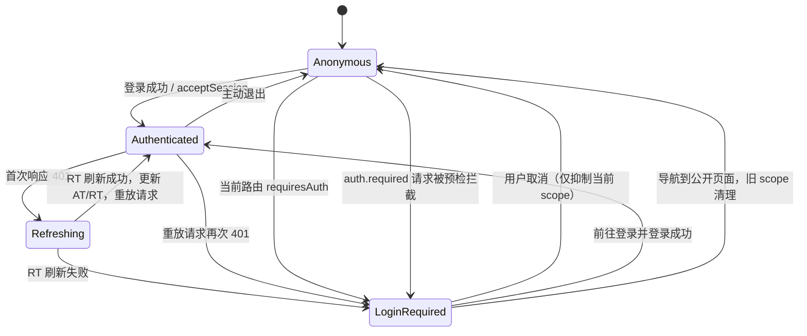
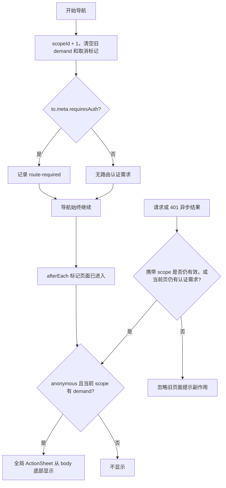

# Mobile 应用模块实施计划

## 1. 计划状态

| 项目 | 当前状态 |
| --- | --- |
| 基线分支 | `main` 已快进同步到 `origin/main` 的 `9778ded` |
| 工作分支 | 已从上述提交创建 `codex/feat-mobile-app` |
| 参考项目 | 已克隆到仓库外 `/Volumes/fc/novum/vant-demo`，当前参考提交 `c382aeba` |
| 本轮范围 | 只准备分支、参考资料和实施方案，不创建 `apps/mobile`，不安装依赖，不实现功能 |
| 远端交付 | 不提交、不推送、不创建 PR |

Vant 一手资料与参考 demo 的核对结果见 [mobile-vant-research.md](./mobile-vant-research.md)。

## 2. 目标与非目标

### 目标

- 在 `apps/mobile` 新增独立的 Vue 3 + TypeScript + Vite 移动端应用。
- 使用 Vant 4，组件和组件样式都按需加载。
- 从 `apps/admin` 只继承仓库接入方式、基础构建文件和已经验证的请求刷新机制；移除 Admin UI、RBAC、后端动态路由、偏好设置和管理页面。
- 路由全部由前端静态声明。只有 `meta.requiresAuth: true` 的路由产生认证需求，导航永不被认证守卫拦截。
- 将路由检查、受保护请求预检、401 刷新结果统一写入一个导航作用域内的认证公共态。
- 全局只挂载一个底部登录询问组件；页面不需要逐个引用它。
- 离开页面时清理旧页面的认证需求，并阻止旧请求的迟到结果在新页面重新弹窗。

### 非目标

- 不复制 Admin 的菜单/RBAC、后端路由生成、管理页面、Element Plus 适配器或 Vben 布局。
- 不改变 `apps/admin` 的行为或文件。
- 不在本次骨架中设计 Mobile 的业务导航、业务页面或权限码体系。
- 不把客户端路由提示当作服务端授权；服务端仍负责保护接口。
- 不引入顶部 NProgress。当前静态路由没有路由数据加载，额外进度条没有足够收益；后续若出现明显等待，再按页面使用 Vant Loading/Overlay。

## 3. 从 Admin 继承的边界

采用“选择性复制并重写”，不先复制整个 `apps/admin` 再留下大量删除噪音。

| Admin 来源 | Mobile 处理 | 原因 |
| --- | --- | --- |
| `.env*`、`index.html` | 复制结构后改名、端口、命名空间、viewport | 保留仓库环境约定，增加移动端安全区前提 |
| `package.json`、`tsconfig*.json` | 复制结构后精简 | 保留 pnpm/Turbo/TypeScript 接入 |
| `vite.config.ts` | 重写为 Vant 按需导入配置 | 删除 Element Plus 插件，关闭 Mobile 不使用的 Vben 构建能力 |
| `src/main.ts`、`src/bootstrap.ts`、`src/app.vue` | 只保留 Vue/Pinia/Router 启动职责并重写 | 去除 preferences、i18n、Element Plus、指令和 Motion |
| `src/api/request.ts` | 保留请求客户端思路并改为认证公共态适配器 | 复用已验证的并发刷新/重放机制 |
| 其余 `apps/admin/src` | 不复制 | 都属于 Admin UI、Admin Session 页面或 RBAC/动态路由实现 |

## 4. 依赖处置

版本进入根 `pnpm-workspace.yaml` catalog，`apps/mobile/package.json` 只使用 `catalog:` 或 `workspace:*`。

### 保留

| 依赖 | 类型 | 用途与约束 |
| --- | --- | --- |
| `dayjs` | dependency | 按要求保留；只在实际日期格式化处导入 |
| `pinia` | dependency | 承载唯一认证公共态 |
| `vue` | dependency | 应用运行时 |
| `vue-router` | dependency | 纯前端静态路由与非拦截式路由 hook |
| `@vben/request` | dependency | 复用 RequestClient、统一响应解包、并发 401 刷新与单次重放；它是无 UI 的请求模块 |
| `@vueuse/core` | dependency | 保留通用组合式工具，并用于页面标题等实际功能，避免闲置依赖 |
| `@vue/test-utils` | devDependency | 验证全局认证提示与 RouterView 协作 |

### 从 Admin 依赖集中删除

| 依赖 | 分类 | 删除原因 |
| --- | --- | --- |
| `element-plus`、`unplugin-element-plus` | UI | Mobile 统一使用 Vant |
| `@vben/common-ui`、`@vben/icons`、`@vben/layouts`、`@vben/styles` | UI | Admin 的组件、图标、布局和样式体系，不进入 Mobile |
| `@vben/access` | Admin 权限 | Mobile 不生成 RBAC 路由，也不做前端权限码过滤 |
| `@vben/plugins` | Admin 插件 | 表格、Motion 等插件无使用点 |
| `@vben/preferences` | Admin 配置 | Mobile 不继承 Admin 偏好设置和布局配置 |
| `@vben/locales` | Admin 国际化 | 初始最小模块不复制 Admin 多语言资源；未来按 Mobile 产品范围独立引入 |
| `@vben/hooks` | Admin/Vben hook | `useAppConfig` 改为直接读取类型化的 `import.meta.env`，其余 hook 无使用点 |
| `@vben/constants` | Admin 常量 | 登录路径等由 Mobile 本地定义，避免隐式绑定 Admin 路由 |
| `@vben/stores` | Admin 共享状态 | 包含访问码、菜单、标签页和偏好持久化；Mobile 改用本地 Pinia store |
| `@vben/types` | Admin 类型 | Mobile 使用本地 RouteMeta/认证类型，不暴露 Vben 路由元数据 |
| `@vben/utils` | 通用工具 | Mobile 没有直接使用点；请求包可保留自己的传递依赖 |

### 新增

| 依赖 | 类型 | 计划版本 | 用途 |
| --- | --- | --- | --- |
| `vant` | dependency | `^4.10.0` | Mobile 唯一 UI 库 |
| `pinia-plugin-persistedstate` | dependency | `^4.7.1` | 只持久化 AT/RT；提示、路由需求、刷新中状态不持久化 |
| `@vant/auto-import-resolver` | devDependency | `^1.3.0` | Vant 组件/函数与对应样式的按需解析 |
| `unplugin-vue-components` | devDependency | `^32.1.0` | 模板中的 Vant 组件按需导入并生成类型声明 |
| `unplugin-auto-import` | devDependency | `^21.0.0` | `showToast` 等 Vant 函数式调用按需导入；不配置 Vue API 全局自动导入 |

Vant 函数式调用是官方文档中特别提示的使用点。Vite 配置会同时配置 `Components` 和 `AutoImport` 的 `VantResolver`，避免只自动导入组件却漏掉函数调用所需样式。

## 5. 模块设计

### 5.1 认证公共态是唯一接口

`useAuthenticationStore` 是一个深模块。路由 hook、请求拦截器和全局 ActionSheet 都只依赖它的窄接口，不互相读取对方数据。

公共状态：

- `session`: `anonymous | authenticated | refreshing`
- `accessToken`、`refreshToken`: 仅令牌持久化
- `scopeId`: 每次目标路由导航递增的页面作用域
- `routeDemand`: 当前目标路由是否声明 `requiresAuth`
- `requestDemand`: 当前作用域是否发起过 `auth.required` 请求
- `reason`: `route-required | request-required | session-expired | null`
- `dismissedScopeId`: 用户取消后，本页面作用域内不重复打扰
- `targetFullPath`: 点击“前往登录”后的回跳目标

`session` 不持久化，而是由已水合的 AT 和瞬时 `refreshing` 标志派生：有 AT 为 `authenticated`，刷新期间为 `refreshing`，否则为 `anonymous`。这样刷新页面后不会出现“令牌已恢复但会话仍是匿名”的双状态；RT 单独存在时不视为已登录。

窄接口：

| 方法 | 调用方 | 行为 |
| --- | --- | --- |
| `enterRoute(to)` | 路由 before hook | 新建作用域、清空旧需求，记录静态路由判断；不返回重定向 |
| `markRouteEntered(scopeId)` | 路由 after hook | 页面进入后才允许显示提示 |
| `noteProtectedRequest(scopeId)` | 请求拦截器 | 记录当前页面的受保护请求需求；无 AT 时产生 `request-required` |
| `beginRefresh()` | 401 刷新回调 | 进入 `refreshing`，不弹窗 |
| `acceptSession(tokens)` | 登录/刷新成功 | 原子更新 AT/RT，清除认证问题 |
| `expireSession()` | 二次 401/刷新失败 | 清令牌；仅当前页面仍有路由或请求需求时显示 `session-expired` |
| `dismissPrompt()` | 全局 ActionSheet | 只抑制当前作用域，不伪造已登录状态 |
| `clearSession()` | 主动退出 | 清令牌和问题状态 |

`shouldPrompt` 是 store 的派生状态：页面已经进入、会话为 anonymous、当前作用域存在认证需求、且本作用域没有被用户取消。提示组件不自行推导 401 或路由条件。

### 5.2 路由 hook 不拦截

- 路由声明使用 `meta.requiresAuth?: boolean`，默认 `false`。
- `beforeEach` 只调用 `enterRoute(to)` 并始终返回 `true`。
- `afterEach` 在导航成功后调用 `markRouteEntered(scopeId)`；因此用户先进入目标页，再看到底部询问。
- `to.meta` 只保存 `requiresAuth` 这类静态声明，不回写匿名/过期等运行时结果。hook 的判断结果写入认证公共态的当前 navigation scope，避免路由记录被旧状态污染。
- 不请求后端菜单，不动态添加路由，不检查角色或权限码。
- 导航开始即递增 `scopeId` 并清理旧 demand。请求配置记录发起时的 `scopeId`，迟到结果不能把旧页面的提示带到新页面。
- 404、登录页和未标记页面默认公开。

### 5.3 无布局副作用的全局挂载

`App.vue` 只渲染一次 `GlobalLayout`。`GlobalLayout` 使用 Vue fragment，根模板是两个兄弟节点：

```vue
<RouterView />
<LoginRequiredActionSheet />
```

它不会生成 `div`、`display`、尺寸、定位或新的 CSS containing block，因此不改变页面盒模型。ActionSheet 设置 `teleport="body"`，浮层节点也不参与 RouterView 页面的文档流。

交互规则：

- 标题简洁说明需要登录。
- 主操作“前往登录”：进入公开登录路由，并携带当前 `fullPath` 作为 redirect。
- 取消操作：关闭并抑制当前页面作用域内的重复提示。
- 设置 `close-on-click-overlay="false"`，避免点击遮罩被误解为选择；关闭只通过明确的取消操作或路由变化发生。
- 登录成功：`acceptSession` 后回到合法的站内 redirect；拒绝外部 URL。
- 路由变化：旧 scope 立即失效，公开页不会继承旧弹窗。

### 5.4 Vant 与安全区

- `index.html` viewport 增加 `viewport-fit=cover`，这是 CSS safe-area 环境变量生效的前提。
- ActionSheet 开启底部安全区适配，并 teleport 到 `body`。
- 基础 CSS 只做 reset、`min-height` 和背景/文本默认值，不引入 Admin/Tailwind/Element 样式。
- 固定底部业务元素后续优先使用 Vant 自带 `safe-area-inset-bottom` 能力；自定义元素才使用 `env(safe-area-inset-bottom)`。
- Vite 生成 `components.d.ts` 和 `auto-imports.d.ts`，二者纳入版本控制，保证 `vue-tsc` 和编辑器一致。

### 5.5 请求认证语义

Mobile 在本地扩展 Axios 请求配置：

```ts
auth?: {
  required?: boolean;
  scopeId?: number;
}
```

- 公共接口默认不要求登录；受保护接口必须显式传 `auth.required: true`。
- 请求拦截器先记录当前 `scopeId`。受保护请求没有 AT 时不发出网络请求，写入公共态并抛出可识别的 `AuthenticationRequiredError`。
- 该错误由统一错误处理器静默识别，避免同时出现 Toast 和 ActionSheet。
- 有 AT 的请求带 Bearer token。401 交给现有 `authenticateResponseInterceptor`：一个刷新请求服务并发 401，刷新成功后重放一次。
- 重放仍为 401，或 RT 刷新失败时，`expireSession()` 清 AT/RT 并按当前页面需求决定是否提示登录。
- 刷新接口使用不挂认证响应拦截器的基础 client，避免刷新请求自身递归刷新。

具体会话接口默认沿用仓库现有 Admin Session 合同（登录 `/sys/admin/login`、刷新 `/sys/admin/refresh`、退出 `/sys/admin/logout`，RT 放 `X-Refresh-Token`）。如果 Mobile 面向的不是 Admin User，执行前必须先确认新的身份域和接口合同，不能把路径静默替换成猜测值。

## 6. 认证状态流转



作用域判定补充：



## 7. 文件变更清单

### 新增

| 路径 | 内容 |
| --- | --- |
| `apps/mobile/AGENTS.md` | Mobile 独立规则：Vant-only UI、静态路由、非拦截认证 hook、受保护请求显式标记 |
| `apps/mobile/CONTEXT.md` | Mobile Session、Authentication Demand、Navigation Scope 等术语表；不放实现约束 |
| `apps/mobile/.env*` | Mobile 标题、命名空间、`5078` 端口、base、API URL 和构建开关 |
| `apps/mobile/index.html`、`public/favicon.ico` | 移动 viewport、安全区前提与基础入口资源 |
| `apps/mobile/package.json` | 精简后的运行/构建/测试依赖和 scripts |
| `apps/mobile/tsconfig.json`、`tsconfig.node.json` | 使用不含 Vben RouteMeta 的 `@vben/tsconfig/web.json`，声明本地路径别名 |
| `apps/mobile/vite.config.ts` | Vant Components + AutoImport resolver；显式关闭 `i18n`、`vxeTableLazyImport`、`injectGlobalScss`、`injectAppLoading`、`extraAppConfig`、`nitroMock`、`pwa`、`archiver`、`license`、`print`、`devtools`、`injectMetadata` 和 `importmap` |
| `apps/mobile/src/main.ts`、`bootstrap.ts`、`app.vue` | 最小 Vue + Pinia persisted-state + Router 启动链 |
| `apps/mobile/src/layouts/global-layout.vue` | 无 DOM 包裹的 RouterView + 全局认证提示宿主 |
| `apps/mobile/src/components/authentication/login-required-action-sheet.vue` | Vant 底部登录询问、取消与 redirect 行为 |
| `apps/mobile/src/stores/authentication.ts` | 唯一认证公共态及导航作用域状态机 |
| `apps/mobile/src/router/index.ts`、`guard.ts`、`routes.ts` | 纯前端路由、`requiresAuth` 元数据、非拦截 hook |
| `apps/mobile/src/api/request.ts`、`session.ts` | 认证请求预检、AT 注入、401 刷新/重放、会话接口适配 |
| `apps/mobile/src/errors/authentication-required.ts` | 可识别的本地请求阻断错误，避免重复错误 UI |
| `apps/mobile/src/types/axios.d.ts`、`vue-router.d.ts` | 请求 auth metadata 和 Mobile RouteMeta 类型扩展 |
| `apps/mobile/src/styles/base.css` | 最小 reset、根高度与安全区辅助样式 |
| `apps/mobile/src/views/home.vue`、`login.vue`、`account.vue`、`not-found.vue` | 最小公开页、登录页、认证示例页和 404；不引入业务假设 |
| `apps/mobile/src/test/**` | 认证 store、路由 hook、请求拦截/刷新、全局 ActionSheet 测试 |
| `docs/plans/mobile-vant-research.md` | 官方资料和 demo 的一手来源记录 |

### 修改

| 路径 | 修改内容 |
| --- | --- |
| `package.json` | 增加 `dev:mobile`、`build:mobile`、`preview:mobile`、`test:mobile`；根 `dev` 是否并行启动 Mobile 在执行时按 review 结论处理 |
| `pnpm-workspace.yaml` | catalog 增加 Vant 和三个按需导入工具；`apps/*` 已覆盖 Mobile，无需改 workspace glob |
| `pnpm-lock.yaml` | 通过 `pnpm install` 生成依赖锁定变化 |
| `cspell.json` | 仅在检查确认 `Vant` 等词触发拼写错误时增加词条 |

### 删除或明确不复制

这些路径只表示从 `admin` 复制模板时不会进入 `mobile`；不会删除 `apps/admin` 中的原文件。

| Mobile 中删除/不复制的 Admin 内容 | 原因 |
| --- | --- |
| `.env.analyze`、构建归档配置 | 最小骨架不做 bundle 可视化和 zip 归档 |
| `src/adapter/**` | 全部绑定 Element Plus/Vben Form/VXE Table |
| `src/layouts/auth.vue`、`basic.vue` | Admin 页面壳、菜单、通知、水印和过期登录 Modal |
| `src/locales/**`、`src/preferences.ts` | Admin 国际化消息和管理端偏好体系 |
| `src/router/access.ts`、动态模块加载和后端路由生成 | Mobile 只有前端静态路由 |
| `src/api/system/**`、Admin 管理 API | RBAC/菜单/用户管理不是 Mobile 骨架职责 |
| Admin store、Admin 登录/资料页、dashboard、system、fallback 页面 | 用 Mobile 最小页面与认证公共态替换 |
| `src/types/element-plus-style-css.d.ts` | Element Plus 已删除 |
| 所有 Admin 专属测试 | 用 Mobile 接口级状态机/路由/请求测试替换 |

## 8. 执行顺序

1. 新增 Mobile 指令/上下文与最小构建骨架，配置独立端口和纯前端路由。
2. 更新 catalog、Mobile 依赖和 lockfile，完成 Vant 组件/函数/样式按需导入。
3. 实现认证公共态及其接口级单元测试，先覆盖作用域重置和三类认证来源。
4. 实现非拦截路由 hook，并验证公开/受保护路由都能完成导航。
5. 接入请求预检和现有并发刷新拦截器，覆盖首次 401 刷新成功、二次 401、刷新失败、无 AT 受保护请求、旧 scope 迟到响应。
6. 实现 fragment GlobalLayout、Vant ActionSheet 和安全 redirect 登录流程。
7. 删除/检查所有 Admin UI 残留和未使用依赖，运行依赖检查。
8. 完成类型、单测、构建、lint 与浏览器视觉/交互验证。

## 9. 验收清单

| 验证 | 命令/方式 | 通过标准 |
| --- | --- | --- |
| 依赖安装 | `pnpm install` | lockfile 正常更新，无 Element Plus/Vben UI 直接依赖进入 Mobile |
| 类型检查 | `pnpm --filter=@app/mobile run typecheck` | 0 错误，生成的 Vant 类型可识别 |
| Mobile 单测 | `pnpm --filter=@app/mobile run test` | 状态机、路由、请求和提示测试全部通过 |
| 构建 | `pnpm --filter=@app/mobile run build` | 生产构建成功；未打入 Element Plus 样式/组件 |
| 仓库检查 | `pnpm run check`、`pnpm run lint` | 依赖、循环引用、类型、拼写和 lint 通过 |
| 路由行为 | Browser/Playwright | 匿名用户可以进入公开页和受保护页；受保护页进入后才弹底部询问，导航未被中断 |
| 请求行为 | 测试 + 浏览器 | 三种场景分别得到刷新重放、登录提示、请求预检阻断；没有重复 Toast |
| 作用域清理 | Browser/Playwright | 取消或从受保护页离开后，公开页不残留弹窗；旧请求迟到不复活弹窗 |
| 安全区 | 390x844、393x852 等移动 viewport 截图 | ActionSheet 操作区不被底部 Home Indicator 覆盖，页面无多余 layout wrapper 影响 |
| 桌面回归 | 1280x800 截图 | Mobile 页面仍可查看，浮层无重叠、文本无溢出 |

## 10. 执行前需确认的产品合同

当前仓库唯一已实现的 AT/RT 合同属于 **Admin Session**。如果 `apps/mobile` 仍供 Admin User 使用，可以直接沿用现有三个会话端点；如果它面向另一类身份，则必须先给出登录、刷新、退出、令牌存储/传输和用户信息接口，随后更新 `apps/mobile/CONTEXT.md`。其余模块搭建、Vant、安全区、静态路由和认证状态机设计不依赖该选择。
